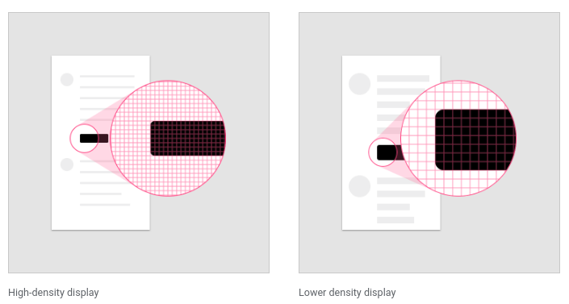
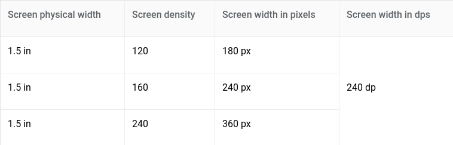
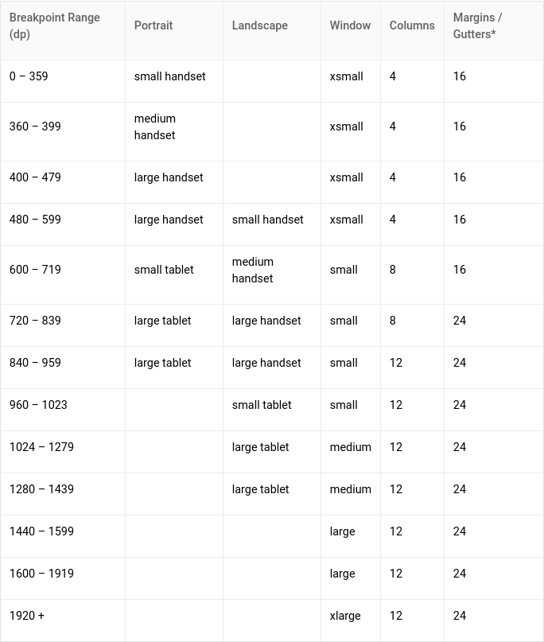

# MaterialDesignSample

# Layout
- Material Design layouts khuyến khích tính nhất quán giữa các nền tảng, môi trường và kích thước màn hình bằng cách sử dụng các yếu tố và khoảng cách đồng nhất.
## Nguyên tắc
- Predictable (dự đoán): UI nên sử dụng bố cục trực quan và thân thuộc với người dùng.
- Consistent (thích hợp): Layout nên sử dụng grid, keyline, padding nhất quán.
- Response (đáp ứng): Layout có khả năng đáp ứng với các tương tác từ user, device và screen.

## Structure
- Material Design layout tạo sự cân bằng thị giác cho người dùng, tạo một giao diện nhất quán, đẹp, chuyên nghiệp. Hầu hết các phép đo đều phù hợp với grid 8dp  điều chỉnh cả khoảng cách và bố cục tổng thể.
- Các thành phần nhỏ hơn như biểu tượng, kiểu chữ có thể căn chỉnh theo grid 4dp.

- Một giao diện nhất quán tạo ra sự chuyên nghiệp và độ tin cậy.
- Tại sao lại là 8dp? 
	+ Do sự đa dạng về kích thước màn hình và mật độ pixel tạo nên sự phức tạp cho các nhà thiết kế.
	+ Phần lớn kích thước màn hình phổ biến chia hết cho 8, giúp dễ dàng điều chỉnh
- Giá trị của hệ thống lưới 8dp:
	+ For designers
	+ For teams
	+ For users

## Pixel density
- Tính toán mật độ điểm ảnh (pixel): <b>Screen density = Screen width (or height) in pixels / Screen width (or height) đơn vị inche</b>

- Đơn vị dp: Là đơn vị linh hoạt có tỷ lệ để có kích thước đồng đều trên bất kỳ màn hình nào. Material UIs sử dụng đơn vị dp để hiển thị các thành phần trên màn hình với mật độ khác nhau.

- 1dp = 1pixel trên màn hình có mật độ 160. Để tính toán dp ta sử dụng công thức: <b>dp = (width in pixels * 160) / screen density</b>

- Đơn vị sp: phục vụ như chức năng của dp nhưng áp dụng với phông chữ.

## Responsive layout grid
- Layout grid được tạo thành từ 3 thành phần: columns, gutters và margins

	

	+ Columns: Nội dung được đặt trong các khu vực của màn hình có chứa các cột. Độ rộng của các cột được xác định bằng tỷ lệ phần trăm (thay vì giá trị cố định) để nội dung thích ứng linh hoạt với mọi 			   kích thước màn hình. Số lượng columns phụ thuộc vào kích thước màn hình.
	

	

	+ Gutters: Khoảng cách giữa các cột. Có giá trị cố định theo từng kích thước màn hình.
	

	

	+ Margins: Là khoảng cách giữa nội dung và các cạnh trái và phải của màn hình. Có giá trị cố định theo từng kích thước màn hình.
	

	

- Grid customization: Có thể được điều chỉnh để đáp ứng nhu cầu và kích cỡ thiết bị khác nhau.

- Breakpoints: Là phạm vi kích thước màn hình. Với mỗi phạm vi breakpoint, layout được điều chỉnh để phù hợp với kích thước và hướng màn hình.

	<video class="video-player__video animatable js-video-player js-video-load anim-appear" loop="" muted="" preload="metadata" tabindex="0">
<source data-src="https://storage.googleapis.com/spec-host/mio-staging%2Fmio-design%2F1563837804615%2Fassets%2F1fsdEL9VNAeJaQjU-bdzLZnZ2IuoPEpYT%2Flayout-responsive-breakpoints.mp4" src="https://storage.googleapis.com/spec-host/mio-staging%2Fmio-design%2F1563837804615%2Fassets%2F1fsdEL9VNAeJaQjU-bdzLZnZ2IuoPEpYT%2Flayout-responsive-breakpoints.mp4" type="video/mp4"> </video>

	+ Layout sử dụng lưới 4-column, 8-column, 12-column có sẵn để sử dụng trên các màn hình.
	

- Grid behavior:
	+ Fluid grids

	+ Fixed grids

- UI regions: UI được tạo thành từ các thành phần như navigation, content areas, app bar,...
	+ Permanent UI regions (Vùng UI cố định)

	+ Persistent UI regions (Vùng UI liên tục)

	+ Temporary UI regions (Vùng UI tạm thời)

## Spacing method
- Baseline:
	+ 8dp: Tất cả các thành phần phù hợp với lưới baseline 8dp cả mobile, tablet, desktop
	

	+ 4dp: icon, typography và một số thành phần có thể căn chỉnh theo grid 4dp.
	

- Spacing:
	+ keyline: Cho phép vị trí nhất quán của các thành phần bên ngoài layout grid. Là các đường thẳng đứng được xác định từ mép màn hình, đo theo gia số 8dp. Nên được sử dụng kết hợp với *responsive layout grid* để đặt các yếu tố nhất quán trong một thiết kế.
	

	+ padding: Không gian giữa các thành phần UI, thay thế cho keyline được đo theo gia số 8dp hoặc 4dp.

	

	+ vertical spacing: Đề cập đến chiều cao của một phần tử, độ cao phù hợp với grid 8dp.
	

	+ increment: Là một phép đo được sử dụng để đo kích thước và vị trí của các thành phần. Là hình vuông có kích thước bất kỳ, nên sử dụng chiều cao của một phần tử tiêu chuẩn (app bar).

- Containers và ratios.
	+ container: là một hình dạng được sử dụng đại diện cho một khu vực, có thể fix cứng hoặc co kéo theo nội dung.
	

	+ ratios: Là tỉ lệ chiều rộng so với chiều cao của phần tử. Để duy trì tính nhất quán trong bố cục, các tỷ lệ khung hình sau được khuyến khích sử dụng.

- Touch and click targets:
	+ Touch target specs: Để cân bằng mật độ thông tin và khả năng sử dụng, các mục tiêu cảm ứng nên có ít nhất 48x48 dp với khoảng cách không gian giữa chúng ít nhất 8dp.

	+ Click targets: Kích thước tối thiểu là 24x24 dp với spacing ít nhất là 8dp
	

## Component behavior
- Component width: 
	+ Có thể giữ nguyên hoặc thay đổi kích thước theo bố cục: fixed, fluid

	+ Các thành phần được fixed width được giữ nguyên khi thay đổi bố cục, có thể thay đổi vị trí để phù hợp với bố cục mới: pushed, Overlaid

- Responsive patterns
	- Các thành phần có thể điều chỉnh kích thước của chúng dựa trên kích thước màn hình và loại thiết bị, chẳng hạn như:
	+ Các thành phần giao diện ẩn đi với màn hình nhỏ có thể hiển thị đối với màn hình lớn
	

	+ Chuyển thành phần từ dạng này sang dạng khác khi ở màn hình lớn
	

	+ Có thể hiển thị nhiều thành phần cùng một lúc nếu có không gian
	

	+ Thay đổi bố cục nếu có không gian

	+ Mở rộng thành phần nếu có nhiều không gian
	

	+ Thay đổi vị trí của các thành phần UI phù hợp với kích thước màn hình
	

## Applying density
- Việc áp dụng density giúp người dùng có nhìn thấy nhiều thông tin hơn và thao tác với lượng lớn dữ liệu hơn chẳng hạn như danh sách, bảng, biểu mẫu.

- Nguyên tắc:
	+ Dễ quan sát: Cải thiện trình duyệt và tương tác với số lượng lớn nội dung.
	+ Độ ưu tiên: Giúp người dùng tập trung bằng cách giảm không gian giữa các hành động.
	+ Tính có sẵn: Mật độ hiển thị nhiều nội dung và hành động trên một màn hình.
### Khi nào nên áp dụng density
- Các thành phần có mật độ cao cho phép user tương tác với lượng thông tin nhiều hơn. Danh sách, bảng, các biểu mẫu dài phù hợp để áp dụng density

### Khi nào không nên áp dụng density
- Không nên áp dụng cho các thành phần tasks hoặc alert-based

### Typographic debsity
- Line height: là khoảng cách giữa các dòng text. Có thể được sử dụng như 1 cách để tạo mật độ trong typographic layouts. Đảm bảo vẫn sử dụng lưới cơ sở 4dp.

# Motion
## Understanding motion
- Motion giúp định hướng người dùng bằng cách hiển thị các thành phần có liên quan với nhau: https://storage.googleapis.com/spec-host/mio-staging%2Fmio-design%2F1563837804615%2Fassets%2F1DenoCsHNb_H1S1zErzmGCxhz6wjmdO8y%2F01-hierarchy-parentchild.mp4

- Motion cung cấp phản hồi kịp thời và trạng thái của hành động người dùng: src="https://storage.googleapis.com/spec-host/mio-staging%2Fmio-design%2F1563837804615%2Fassets%2F1G-MNFco8ApWpcnN5hkbiS2QnK1f1jW-Z%2F02-feedback-password.mp4

- Motion giúp hướng dẫn người dùng cách thực hiện các hành động: https://storage.googleapis.com/spec-host/mio-staging%2Fmio-design%2F1563837804615%2Fassets%2F1FhotRqhTI6ITEzsJnI6RUl4CRa9FlAay%2F03-usereducation-gesture.mp4

- Motion tạo sự thu hút người dùng tương tác với app: https://storage.googleapis.com/spec-host/mio-staging%2Fmio-design%2F1563837804615%2Fassets%2F19Ms-MRmEZ2cGQNicpePPRjHxxa0NkxIm%2F04-juggler.mp4

- Motion hướng sự chú ý của người dùng một cách trơn tru, không bị gián đoạn. Khi UI thay đổi, motion cung cấp tính liên tục giữa các yếu tố trước và sau. Tính liên tục được thể hiện bằng một hoặc nhiều kỹ thuật sau:
	+ Tweening (FAB): Áp dụng cho 1 thành phần hoặc thành phần theo thời gian
	+ Fading (mờ dần): Ví dụ chuyển đổi giữa các hình ảnh.
	+ Shared transformation
- Tham khảo thêm về các kỹ thuật: https://material.io/design/motion/understanding-motion.html#expressing-continuity

## Nguyên tắc Animation trong Material Design
- Tất cả các thành phần giao diện phải phù hợp với logic tổng thể duy nhất.
	+ Tạo ra một user flow ảnh hưởng đáng kể tới trải nghiệm người dùng trong ngữ cảnh của ứng dụng.
	+ Easing một công cụ làm cho animation được cảm nhận theo cách tự nhiên hơn (CoordinatorLayout và CollapsingToolbarLayout)

- Đảm bảo các thành phần tăng tốc dần dần và làm chậm
	+ Làm cho quá trình chuyển đổi liền mạch, hợp lý và thực tế.
- Tận dụng các icon animations
	+ Một cách tiếp cận mới mẻ, tạo ra ảnh hưởng tích cực đến cả dịch vụ

- Tạo thời gian khác nhau cho các mục chuyển động khác nhau
	+ Việc trình bày tất cả các thành phần cùng 1 lúc khiến người dùng mất tập trung, không nhận ra nơi nào cần focus.
- Sự dịch chuyển đối tượng phải được phối hợp theo cùng một hướng

- Tất cả các item sẽ có hiệu ứng khi chạm vào.
- Xây dựng một sự chuyển giao mượt mà từ trang này sang trang khác.

- Hiệu ứng hình ảnh
- Xác định những thành phần nào cần phải focus trước khi tạo animation
- Duration
	+ 200-500ms là tốc độ animation tốt nhất

# Tài liệu tham khảo
- https://material.io/design/layout/applying-density.html#usage
- https://uxplanet.org/10-principles-of-animation-in-material-design-53b870e74629
- https://proandroiddev.com/playing-with-material-design-transitions-b3ea90c5794c
- https://builttoadapt.io/intro-to-the-8-point-grid-system-d2573cde8632

