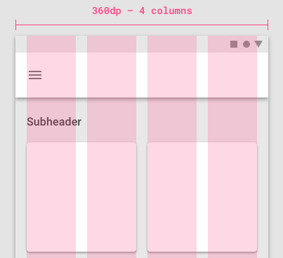
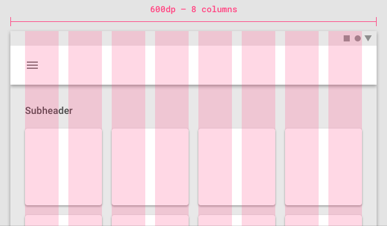
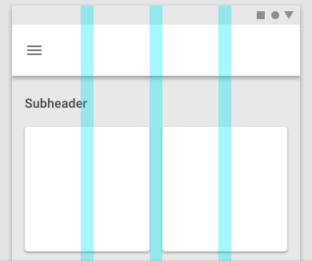
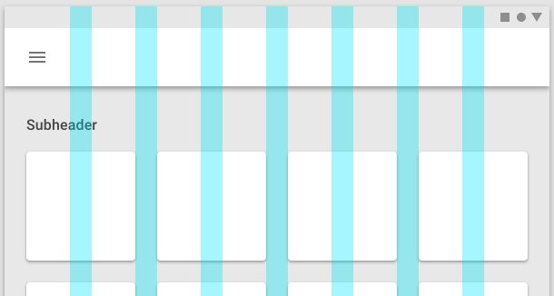
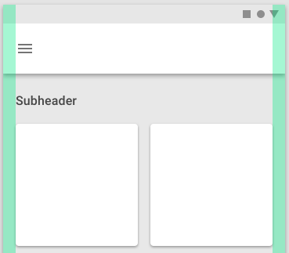
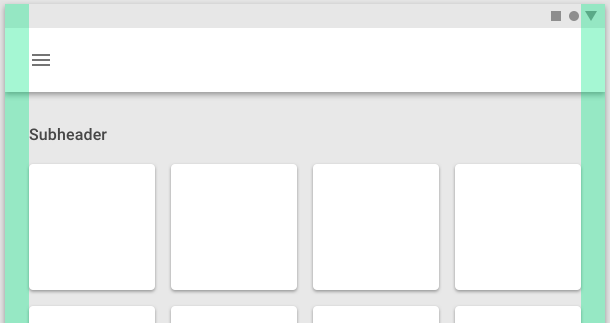
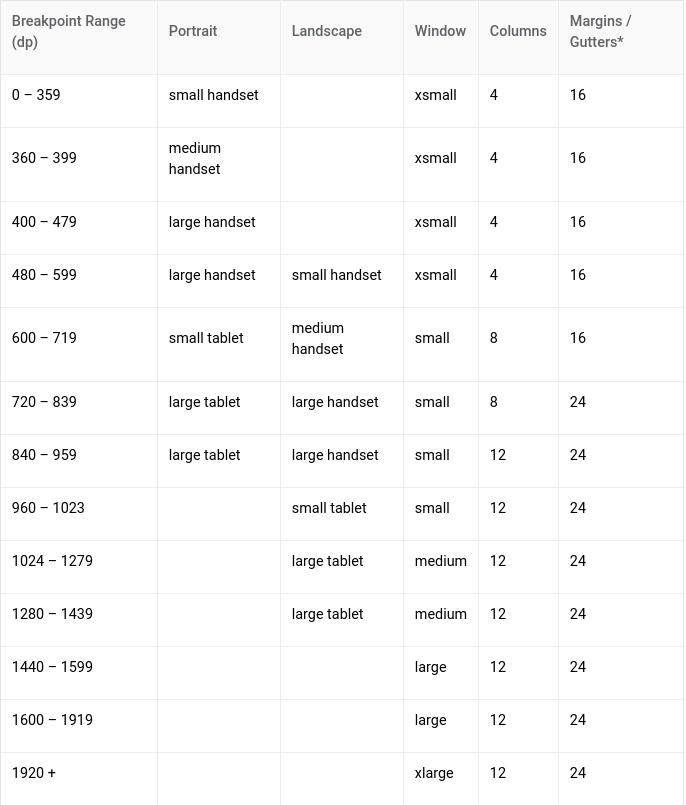
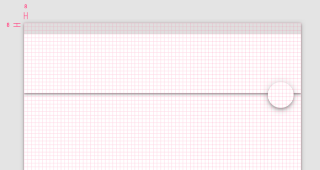
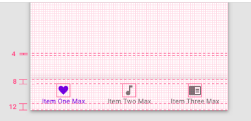
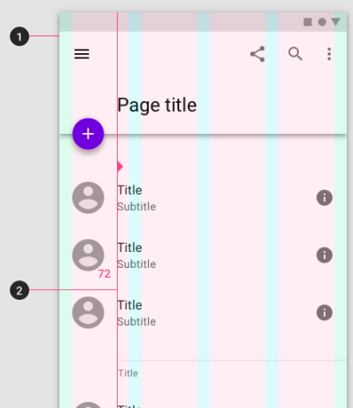

# MaterialDesignSample

# Layout
- Material Design layouts khuyến khích tính nhất quán giữa các nền tảng, môi trường và kích thước màn hình bằng cách sử dụng các yếu tố và khoảng cách đồng nhất.
## Nguyên tắc
- Dự đoán: UI nên sử dụng bố cục trực quan và có thể dự đoán được, với các vùng UI và tổ chức không gian nhất quán.
- Thích hợp: Layout nên sử dụng grid, keyline, padding nhất quán.
- Đáp ứng: Layout có khả năng đáp ứng với đầu vào từ user, device và screen.
## Structure
- Material Design layout được cân bằng trực quan. Hầu hết các phép đo đều phù hợp với grid 8dp, điều chỉnh cả khoảng cách và bố cục tổng thể.
- Các thành phần nhỏ hơn như biểu tượng, kiểu chữ có thể căn chỉnh theo grid 4dp.
## Mật độ và độ phân giải
- Tùy thuộc vào từng nền tảng
- Mật độ điểm ảnh (pixel): Số lượng pixel phù hợp với 1 inch.
- High-density có nhiều pixel/1inch hơn low-density. Do đó, thành phần UI có cùng pixel sẽ xuất hiện lớn hơn trên màn hình mật độ thấp và nhỏ hơn ở màn hình mật độ cao.
- Tính toán mật độ điểm ảnh (pixel): <b>Screen density = Screen width (or height) in pixels / Screen width (or height) in inches</b>
- pixel độc lập với mật độ (dp): Đề cập đến việc hiển thị thống nhất các thành phần UI trên màn hình với mật độ khác nhau.
	+ dp: Là đơn vị linh hoạt có tỷ lệ để có kích thước đồng đều trên bất kỳ màn hình nào.
	+ Material UIs sử dụng dp để hiển thị các thành phần trên màn hình với mật độ khác nhau.
- 1dp = 1pixel trên màn hình có mật độ 160. Để tính toán dp ta sử dụng công thức: *dp = (width in pixels * 160) / screen density*

- Đơn vị sp: phục vụ như chức năng của dp nhưng áp dụng với phông chữ.

## Responsive layout grid
- Để thích ứng với kích thước và hướng màn hình, đảm bảo tính nhất quán giữa các bố cục.
- Layout grid được tạo thành từ 3 thành phần: columns, gutters và margins
	+ Columns: Nội dung được đặt trong các khu vực của màn hình có chứa các cột. Độ rộng của các cột được xác định bằng tỷ lệ phần trăm (thay vì giá trị cố định) để nội dung thích ứng linh hoạt với mọi kích thước màn hình. Số lượng columns phụ thuộc vào kích thước màn hình.
	

	

	+ Gutters: Khoảng cách giữa các cột. Có giá trị cố định theo từng kích thước màn hình.
	

	

	+ Margins: Là khoảng cách giữa nội dung và các cạnh trái và phải của màn hình. Có giá trị cố định theo từng kích thước màn hình.
	

	

- Grid customization: Có thể được điều chỉnh để đáp ứng nhu cầu của cả sản phẩm và kích cỡ thiết bị khác nhau.
- Breakpoints: Là phạm vi kích thước màn hình. Với mỗi phạm vi breakpoint, layout được điều chỉnh để phù hợp với kích thước và hướng màn hình.
	+ Layout sử dụng lưới 4-column, 8-column, 12-column có sẵn để sử dụng trên các màn hình.
	

## Spacing method
- Baseline:
	+ 8dp: Tất cả các thành phần phù hợp với lưới baseline 8dp cả mobile, tablet, desktop
	

	+ 4dp: icon, typography và một số thành phần có thể căn chỉnh theo grid 4dp.
	

- Spacing:
	+ keyline: được xác định từ mép màn hình, đo theo gia số 8dp. Nên được sử dụng kết hợp với *responsive layout grid* để đặt các yếu tố nhất quán trong một thiết kế.
	

	+ padding: Không gian giữa các thành phần UI, được đo theo gia số 8dp hoặc 4dp. Nên sử dụng kết hợp với *responsive layout grid*
	

	+ vertical spacing: Đề cập đến chiều cao của một phần tử, độ cao phù hợp với grid 8dp.
	

	+ increment: Là một phép đo được sử dụng để đo kích thước và vị trí của các thành phần. Là hình vuông có kích thước bất kỳ, nên sử dụng chiều cao của một phần tử tiêu chuẩn (app bar).

- Containers và ratios.
	+ container: là một hình dạng được sử dụng đại diện cho một khu vực, có thể fix cứng hoặc co kéo theo nội dung.
	

	+ ratios: (width:height) Để duy trì tính nhất quán trong bố cục
	

- Touch and click targets:
	+ Touch target specs: Để cân bằng mật độ thông tin và khả năng sử dụng, các mục tiêu cảm ứng nên có ít nhất 48x48 dp với khoảng cách không gian giữa chúng ít nhất 8dp.
	

	+ Click targets: Kích thước tối thiểu là 24x24 dp với spacing ít nhất là 8dp
	

## Component behavior
- Component width: 
	+ Có thể giữ nguyên hoặc thay đổi kích thước theo bố cục: fixed, fluid
	+ Được giữ nguyên khi thay đổi bố cục, có thể thay đổi vị trí để phù hợp với bố cục mới: pushed, Overlaid

- Responsive patterns
	- Các thành phần có thể điều chỉnh kích thước của chúng dựa trên kích thước màn hình và loại thiết bị, chẳng hạn như:
	+ Các thành phần giao diện ẩn đi với màn hình nhỏ có thể hiển thị đối với màn hình lớn
	

	+ Chuyển thành phần từ dạng này sang dạng khác khi ở màn hình lớn
	

	+ Có thể hiển thị nhiều thành phần cùng một lúc nếu có không gian
	

	+ Thay đổi bố cục nếu có không gian
	

	+ Mở rộng thành phần.
	

	+ Thay đổi vị trí của các thành phần UI phù hợp với kích thước màn hình
	

## Applying density
- Nguyên tắc:
	+ Dễ quan sát: Cải thiện trình duyệt và tương tác với số lượng lớn nội dung.
	+ Độ ưu tiên: Giúp người dùng tập trung bằng cách giảm không gian giữa các hành động.

# Tài liệu tham khảo
- https://material.io/design/layout/applying-density.html#usage

