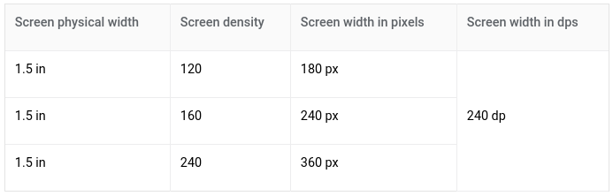

# MaterialDesignSample

# Layout
- Material Design layouts khuyến khích tính nhất quán giữa các nền tảng, môi trường và kích thước màn hình bằng cách sử dụng các yếu tố và khoảng cách đồng nhất.
## Nguyên tắc
- Predictable (dự đoán): UI nên sử dụng bố cục trực quan và có thể dự đoán được, với các vùng UI và tổ chức không gian nhất quán.
- Consistent (thích hợp): Layout nên sử dụng grid, keyline, padding nhất quán.
- Response (đáp ứng): Layout có khả năng đáp ứng với đầu vào từ user, device và screen.

## Structure
- Material Design layout được cân bằng trực quan. Hầu hết các phép đo đều phù hợp với grid 8dp, điều chỉnh cả khoảng cách và bố cục tổng thể.
- Các thành phần nhỏ hơn như biểu tượng, kiểu chữ có thể căn chỉnh theo grid 4dp.

## Pixel density
- Tính toán mật độ điểm ảnh (pixel): <b>Screen density = Screen width (or height) in pixels / Screen width (or height) đơn vị inche</b>

- Đơn vị dp: Là đơn vị linh hoạt có tỷ lệ để có kích thước đồng đều trên bất kỳ màn hình nào. Material UIs sử dụng đơn vị dp để hiển thị các thành phần trên màn hình với mật độ khác nhau.

- 1dp = 1pixel trên màn hình có mật độ 160. Để tính toán dp ta sử dụng công thức: <b>dp = (width in pixels * 160) / screen density</b>

- Đơn vị sp: phục vụ như chức năng của dp nhưng áp dụng với phông chữ.

## Responsive layout grid
- Layout grid được tạo thành từ 3 thành phần: columns, gutters và margins

	

	+ Columns: Nội dung được đặt trong các khu vực của màn hình có chứa các cột. Độ rộng của các cột được xác định bằng tỷ lệ phần trăm (thay vì giá trị cố định) để nội dung thích ứng linh hoạt với mọi 			   kích thước màn hình. Số lượng columns phụ thuộc vào kích thước màn hình.
	

	

	+ Gutters: Khoảng cách giữa các cột. Có giá trị cố định theo từng kích thước màn hình.
	

	

	+ Margins: Là khoảng cách giữa nội dung và các cạnh trái và phải của màn hình. Có giá trị cố định theo từng kích thước màn hình.
	

	

- Grid customization: Có thể được điều chỉnh để đáp ứng nhu cầu và kích cỡ thiết bị khác nhau.

- Breakpoints: Là phạm vi kích thước màn hình. Với mỗi phạm vi breakpoint, layout được điều chỉnh để phù hợp với kích thước và hướng màn hình.

	<video class="video-player__video animatable js-video-player js-video-load anim-appear" loop="" muted="" preload="metadata" tabindex="0">
<source data-src="https://storage.googleapis.com/spec-host/mio-staging%2Fmio-design%2F1563837804615%2Fassets%2F1fsdEL9VNAeJaQjU-bdzLZnZ2IuoPEpYT%2Flayout-responsive-breakpoints.mp4" src="https://storage.googleapis.com/spec-host/mio-staging%2Fmio-design%2F1563837804615%2Fassets%2F1fsdEL9VNAeJaQjU-bdzLZnZ2IuoPEpYT%2Flayout-responsive-breakpoints.mp4" type="video/mp4"> </video>

	+ Layout sử dụng lưới 4-column, 8-column, 12-column có sẵn để sử dụng trên các màn hình.
	

- Grid behavior:
	+ Fluid grids

	+ Fixed grids

- UI regions: UI được tạo thành từ các thành phần như navigation, content areas, app bar,...
	+ Permanent UI regions (Vùng UI cố định)

	+ Persistent UI regions (Vùng UI liên tục)

	+ Temporary UI regions (Vùng UI tạm thời)

## Spacing method
- Baseline:
	+ 8dp: Tất cả các thành phần phù hợp với lưới baseline 8dp cả mobile, tablet, desktop
	

	+ 4dp: icon, typography và một số thành phần có thể căn chỉnh theo grid 4dp.
	

- Spacing:
	+ keyline: được xác định từ mép màn hình, đo theo gia số 8dp. Nên được sử dụng kết hợp với *responsive layout grid* để đặt các yếu tố nhất quán trong một thiết kế.
	

	+ padding: Không gian giữa các thành phần UI, được đo theo gia số 8dp hoặc 4dp. Nên sử dụng kết hợp với *responsive layout grid*
	

	+ vertical spacing: Đề cập đến chiều cao của một phần tử, độ cao phù hợp với grid 8dp.
	

	+ increment: Là một phép đo được sử dụng để đo kích thước và vị trí của các thành phần. Là hình vuông có kích thước bất kỳ, nên sử dụng chiều cao của một phần tử tiêu chuẩn (app bar).

- Containers và ratios.
	+ container: là một hình dạng được sử dụng đại diện cho một khu vực, có thể fix cứng hoặc co kéo theo nội dung.
	

	+ ratios: (width:height) Để duy trì tính nhất quán trong bố cục
	

- Touch and click targets:
	+ Touch target specs: Để cân bằng mật độ thông tin và khả năng sử dụng, các mục tiêu cảm ứng nên có ít nhất 48x48 dp với khoảng cách không gian giữa chúng ít nhất 8dp.
	

	+ Click targets: Kích thước tối thiểu là 24x24 dp với spacing ít nhất là 8dp
	

## Component behavior
- Component width: 
	+ Có thể giữ nguyên hoặc thay đổi kích thước theo bố cục: fixed, fluid
	+ Được giữ nguyên khi thay đổi bố cục, có thể thay đổi vị trí để phù hợp với bố cục mới: pushed, Overlaid

- Responsive patterns
	- Các thành phần có thể điều chỉnh kích thước của chúng dựa trên kích thước màn hình và loại thiết bị, chẳng hạn như:
	+ Các thành phần giao diện ẩn đi với màn hình nhỏ có thể hiển thị đối với màn hình lớn
	

	+ Chuyển thành phần từ dạng này sang dạng khác khi ở màn hình lớn
	

	+ Có thể hiển thị nhiều thành phần cùng một lúc nếu có không gian
	

	+ Thay đổi bố cục nếu có không gian
	

	+ Mở rộng thành phần.
	

	+ Thay đổi vị trí của các thành phần UI phù hợp với kích thước màn hình
	

## Applying density
- Việc áp dụng density giúp người dùng có nhìn thấy nhiều thông tin hơn và thao tác với lượng lớn dữ liệu hơn chẳng hạn như danh sách, bảng, biểu mẫu.

- Nguyên tắc:
	+ Dễ quan sát: Cải thiện trình duyệt và tương tác với số lượng lớn nội dung.
	+ Độ ưu tiên: Giúp người dùng tập trung bằng cách giảm không gian giữa các hành động.
	+ Có sẵn: Mật độ hiển thị nhiều nội dung và hành động trên một màn hình.
- Không nên áp dụng mật độ cao cho các thành phần nhiệm vụ hoặc cảnh báo: date picker, dialog
- 

# Motion
- Chuyển động làm cho giao diện người dùng biểu cảm và dễ sử dụng
## Nguyên tắc
- Nhiều thông tin: Chuyển động cho thấy mối quan hệ không gian và phân cấp giữa các yếu tố, hành động nào có sẵn và điều gì sẽ xảy ra nếu có một hành động được thực hiện
- Tập trung: Tập trung sự chú ý vào những gì quan trọng.
- Biểu cảm: Tạo cảm giác trải nghiệm cho người dùng.

# Color
- Hệ thống màu hỗ trợ 12 màu có thể được áp dụng với các thành phần, văn bản, biểu tượng và bề mặt.
	+ Primary: Màu thương hiệu của app, được sử dụng chủ yếu.
	+ Primary Variant: Một biển thể sáng/tối hơn của màu chính: app bar
	+ On Primary: Được sử dụng cho các thành phần được hiển thị bên trên các màu chính (văn bản và biểu tượng: đen or trắng)
	+ Secondary: Màu thương hiệu thứ cấp của app, làm điểm nhấn cho 1 số thành phần cần nổi bật
	+ Secondary Variant: Một biến thể sáng/tối hơn của màu thương hiệu thứ cấp
	+ On Secondary: Màu được sử dụng cho các thành phần được hiển thị bên trên các màu thương hiệu thứ cấp
	+ Background: Màu nền
	+ On Background: Màu được sử dụng cho các thành phần hiển thị trên màu nền
	+ Surface: Màu sử dụng cho các bề mặt (drawer, sheets, tab,...)
	+ On Surface: Màu sử dụng cho các thành phần hiển thị trên màu surface
	+ Error: Màu sử dụng cho các lỗi (thường là màu đổ)
	+ On Error: Màu sử dụng cho các thành phần hiển thị trên màu lỗi.

	

# Typography

## Sử dụng
- Chuyển động giúp định hướng người dùng bằng cách hiển thị các yếu tố có liên quan đến nhau.
- Chuyển động cung cấp phản hồi kịp thời và trạng thái của người dùng như xác thực mật khẩu, load nội dung.
- Hướng dẫn người dùng: mở khóa màn hình...
- Kích thích người dùng sử dụng app.
# Tài liệu tham khảo
- https://material.io/design/layout/applying-density.html#usage

